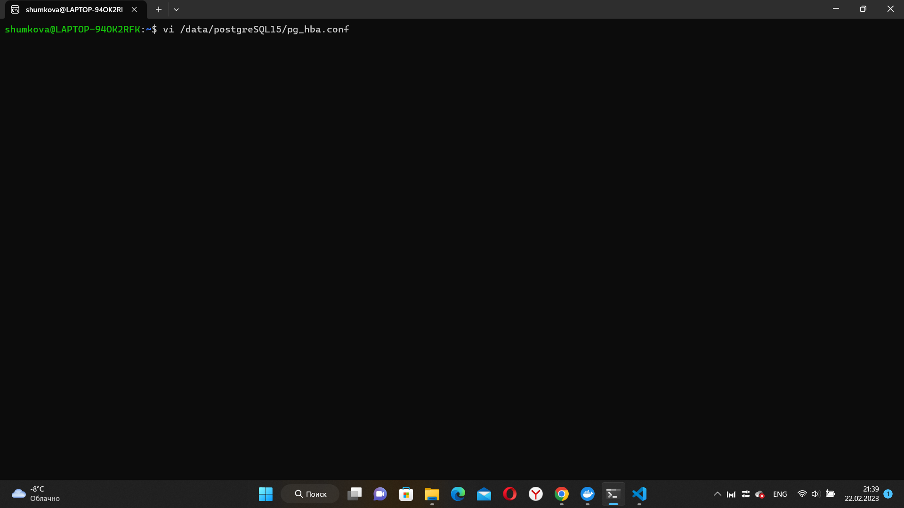
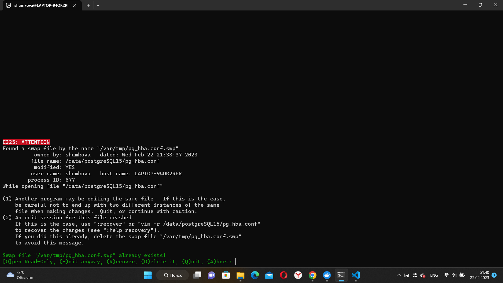
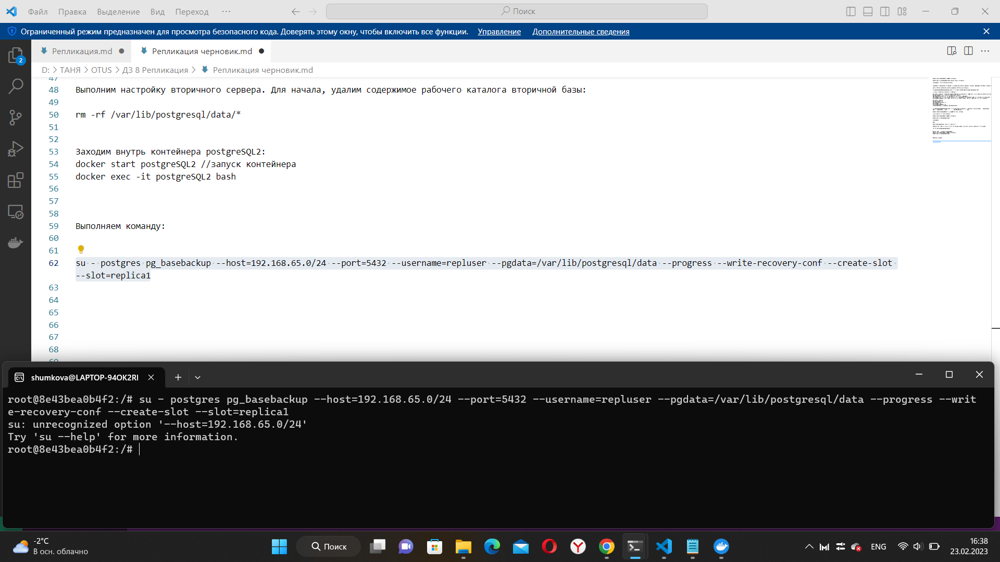
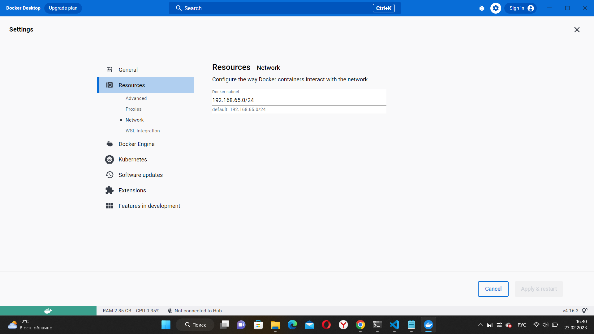

1. Физическая репликация:

Весь стенд собирается в Docker образах или ВМ. Необходимо:

-Настроить физическую репликации между двумя кластерами базы данных
-Репликация должна работать использую "слот репликации"
-Реплика должна отставать от мастера на 5 минут

1) Контейнер №1

docker start postgreSQL15 //запуск контейнера

docker exec -it postgreSQL15 bash //подключение к контейнеру

su postgres  //ввод имени пользователя

createuser --replication -P repluser // Создаем пользователя repluser с правами репликации и с паролем

psql         //вход в постгрес в докере

show wal_level;  //просмотр уровня репликации

show listen_addresses; //просмотр какой хост

Не получилось сделать:

vi /data/postgreSQL15/pg_hba.conf // открываем файл И добавляем строку после остальных «host    replication»

host    replication     all             192.168.65.0/24           md5

2) Создание второго контейнера

docker run --name postgreSQL2 -e POSTGRES_PASSWORD=my_postgres2 -p 5433:5433 -d postgres //создание и запуск второго контейнера в докере постгрес

su postgres  //ввод имени пользователя

psql         //вход в постгрес в докере

show listen_addresses; //просмотр какой хост

Выполним настройку вторичного сервера. Для начала, удалим содержимое рабочего каталога вторичной базы:

rm -rf /var/lib/postgresql/data/*

Заходим внутрь контейнера postgreSQL2:

docker start postgreSQL2 //запуск контейнера

docker exec -it postgreSQL2 bash

Выполняем команду:

su - postgres pg_basebackup --host=192.168.65.0/24 --port=5432 --username=repluser --pgdata=/var/lib/postgresql/data --progress --write-recovery-conf --create-slot --slot=replica1

Данная команда не выполняется.

